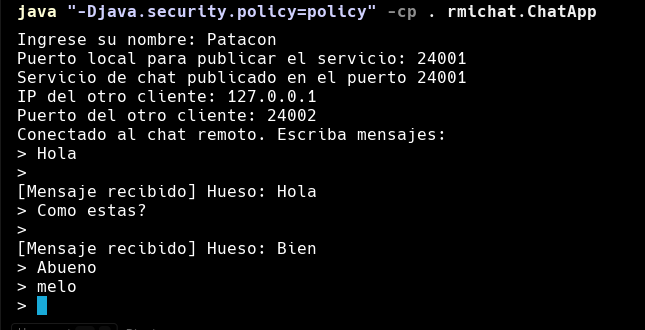
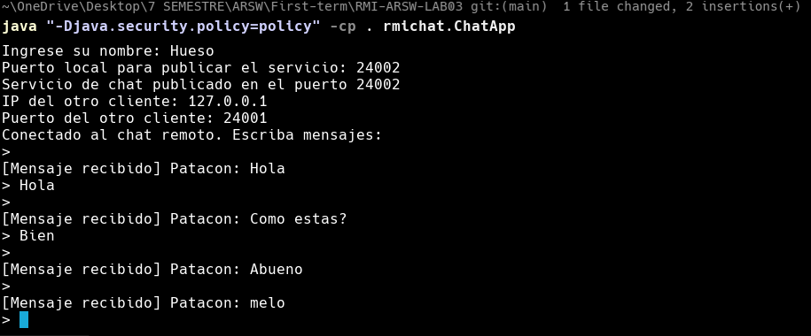

# RMI-ARSW-LAB03

Proyecto con dos ejemplos de Java RMI: un servicio Echo basico y un chat entre dos clientes. El objetivo es practicar la publicacion y consumo de objetos remotos usando `rmiregistry`.

## Estructura
- `EchoServer`, `EchoServerImpl`, `EchoClient`: ejemplo sencillo de invocacion remota.
- `rmichat/ChatService`, `rmichat/ChatServiceImpl`, `rmichat/ChatApp`: chat P2P donde cada instancia actua como cliente y servidor.
- `policy`: permisos de seguridad usados al ejecutar.

## Logica e implementacion (resumen)
### Echo
- `EchoServer` define la interfaz remota con el metodo `echo`.
- `EchoServerImpl` exporta el objeto remoto y lo registra en el `rmiregistry`.
- `EchoClient` obtiene el stub desde el registro y llama `echo`.

### Chat
- `ChatService` define el metodo remoto `recibirMensaje`.
- `ChatServiceImpl` imprime el mensaje recibido.
- `ChatApp` crea su propio `rmiregistry`, publica su servicio y se conecta al servicio del otro cliente. Luego envia mensajes con un bucle de lectura por consola.

## Compilacion
Ejecutar desde la raiz del proyecto:

```bat
javac -d . EchoServer.java EchoServerImpl.java EchoClient.java
javac -d . rmichat\ChatService.java rmichat\ChatServiceImpl.java rmichat\ChatApp.java
```

## Ejecucion del ejemplo Echo
En una terminal, iniciar el `rmiregistry`:

```bat
rmiregistry 23000
```

En otra terminal, iniciar el servidor:

```bat
java "-Djava.security.policy=policy" -cp . rmiexample.EchoServerImpl
```

En otra terminal, ejecutar el cliente:

```bat
java "-Djava.security.policy=policy" -cp . rmiexample.EchoClient
```

Salida esperada en el cliente:

```
desde el servidor: Hola como estas?
```

## Ejecucion del chat RMI
Abrir dos terminales (dos instancias del chat). Ejecutar el mismo comando en cada terminal:

```bat
java "-Djava.security.policy=policy" -cp . rmichat.ChatApp
```

Ejemplo de inputs en el Cliente A:

```
Ingrese su nombre: Ana
Puerto local para publicar el servicio: 24001
IP del otro cliente: 127.0.0.1
Puerto del otro cliente: 24002
```

Ejemplo de inputs en el Cliente B:

```
Ingrese su nombre: Luis
Puerto local para publicar el servicio: 24002
IP del otro cliente: 127.0.0.1
Puerto del otro cliente: 24001
```

Luego escribir mensajes y salir con `salir`.

## Ejemplo de uso del chat:
**Usuario 1:**


**Usuario 2:**
